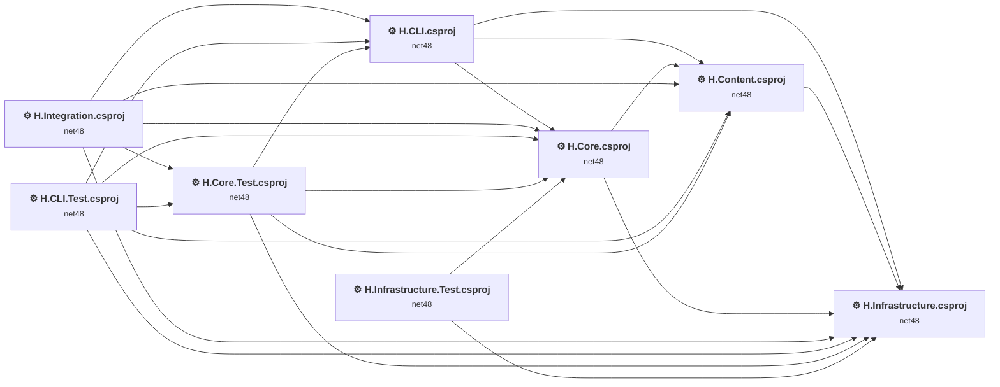
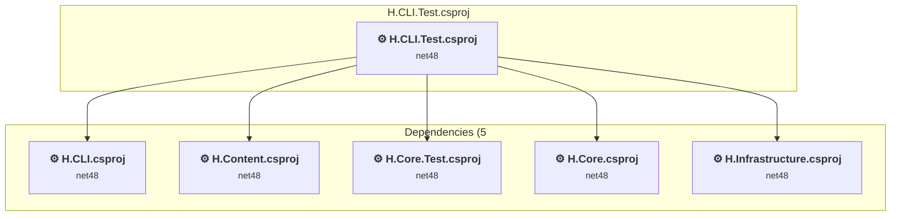
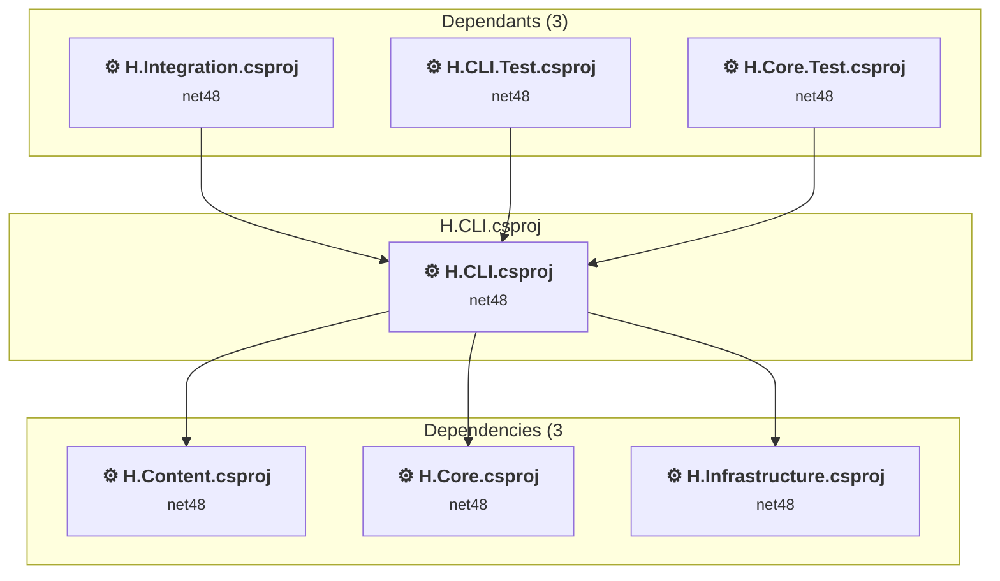
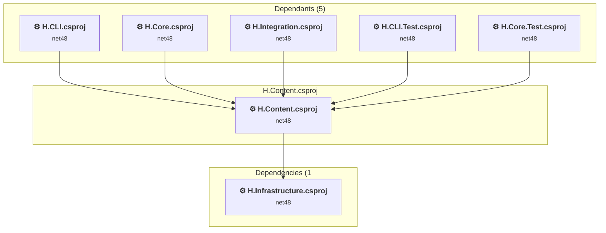
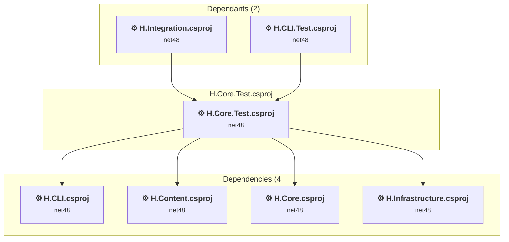
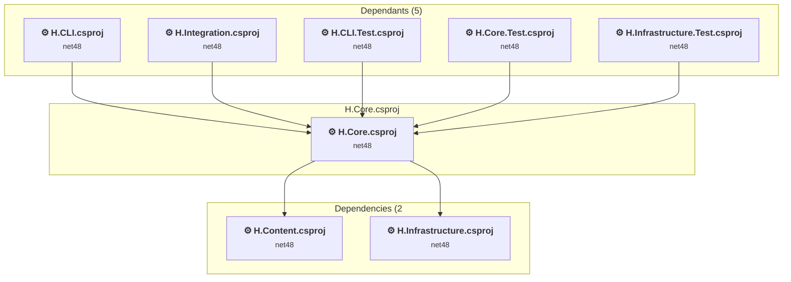
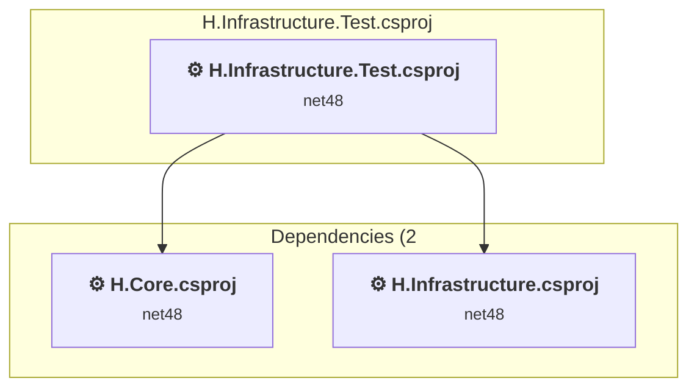
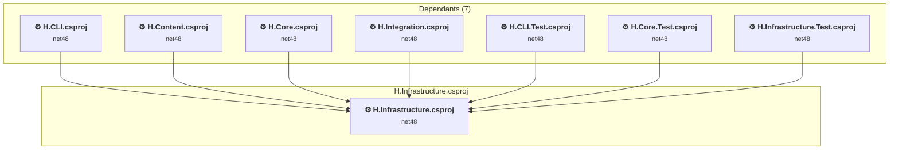
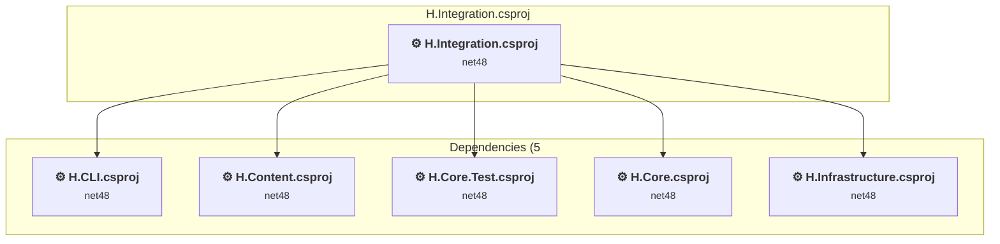

# Projects and dependencies analysis

This document provides a comprehensive overview of the projects and their dependencies in the context of upgrading to .NETCoreApp,Version=v10.0.

## Table of Contents

- [Executive Summary](#executive-Summary)
  - [Highlevel Metrics](#highlevel-metrics)
  - [Projects Compatibility](#projects-compatibility)
  - [Package Compatibility](#package-compatibility)
  - [API Compatibility](#api-compatibility)
- [Aggregate NuGet packages details](#aggregate-nuget-packages-details)
- [Top API Migration Challenges](#top-api-migration-challenges)
  - [Technologies and Features](#technologies-and-features)
  - [Most Frequent API Issues](#most-frequent-api-issues)
- [Projects Relationship Graph](#projects-relationship-graph)
- [Project Details](#project-details)

  - [H.CLI.Test\H.CLI.Test.csproj](#hclitesthclitestcsproj)
  - [H.CLI\H.CLI.csproj](#hclihclicsproj)
  - [H.Content\H.Content.csproj](#hcontenthcontentcsproj)
  - [H.Core.Test\H.Core.Test.csproj](#hcoretesthcoretestcsproj)
  - [H.Core\H.Core.csproj](#hcorehcorecsproj)
  - [H.Infrastructure.Test\H.Infrastructure.Test.csproj](#hinfrastructuretesthinfrastructuretestcsproj)
  - [H.Infrastructure\H.Infrastructure.csproj](#hinfrastructurehinfrastructurecsproj)
  - [H.Integration\H.Integration.csproj](#hintegrationhintegrationcsproj)

## Executive Summary

### Highlevel Metrics

| Metric | Count | Status |
| :--- | :---: | :--- |
| Total Projects | 8 | All require upgrade |
| Total NuGet Packages | 18 | 5 need upgrade |
| Total Code Files | 960 |  |
| Total Code Files with Incidents | 24 |  |
| Total Lines of Code | 173350 |  |
| Total Number of Issues | 76 |  |
| Estimated LOC to modify | 36+ | at least 0.0% of codebase |

### Projects Compatibility

| Project | Target Framework | Difficulty | Package Issues | API Issues | Est. LOC Impact | Description |
| :--- | :---: | :---: | :---: | :---: | :---: | :--- |
| [H.CLI.Test\H.CLI.Test.csproj](#hclitesthclitestcsproj) | net48 | 🟢 Low | 3 | 0 |  | ClassicClassLibrary, Sdk Style = False |
| [H.CLI\H.CLI.csproj](#hclihclicsproj) | net48 | 🟢 Low | 3 | 7 | 7+ | ClassicDotNetApp, Sdk Style = False |
| [H.Content\H.Content.csproj](#hcontenthcontentcsproj) | net48 | 🟢 Low | 2 | 0 |  | ClassicClassLibrary, Sdk Style = False |
| [H.Core.Test\H.Core.Test.csproj](#hcoretesthcoretestcsproj) | net48 | 🟢 Low | 3 | 12 | 12+ | ClassicClassLibrary, Sdk Style = False |
| [H.Core\H.Core.csproj](#hcorehcorecsproj) | net48 | 🟢 Low | 7 | 16 | 16+ | ClassicWpf, Sdk Style = False |
| [H.Infrastructure.Test\H.Infrastructure.Test.csproj](#hinfrastructuretesthinfrastructuretestcsproj) | net48 | 🟢 Low | 1 | 0 |  | ClassicClassLibrary, Sdk Style = False |
| [H.Infrastructure\H.Infrastructure.csproj](#hinfrastructurehinfrastructurecsproj) | net48 | 🟢 Low | 2 | 1 | 1+ | ClassicWpf, Sdk Style = False |
| [H.Integration\H.Integration.csproj](#hintegrationhintegrationcsproj) | net48 | 🟢 Low | 3 | 0 |  | ClassicClassLibrary, Sdk Style = False |

### Package Compatibility

| Status | Count | Percentage |
| :--- | :---: | :---: |
| ✅ Compatible | 13 | 72.2% |
| ⚠️ Incompatible | 0 | 0.0% |
| 🔄 Upgrade Recommended | 5 | 27.8% |
| ***Total NuGet Packages*** | ***18*** | ***100%*** |

### API Compatibility

| Category | Count | Impact |
| :--- | :---: | :--- |
| 🔴 Binary Incompatible | 6 | High - Require code changes |
| 🟡 Source Incompatible | 30 | Medium - Needs re-compilation and potential conflicting API error fixing |
| 🔵 Behavioral change | 0 | Low - Behavioral changes that may require testing at runtime |
| ✅ Compatible | 132024 |  |
| ***Total APIs Analyzed*** | ***132060*** |  |

## Aggregate NuGet packages details

| Package | Current Version | Suggested Version | Projects | Description |
| :--- | :---: | :---: | :--- | :--- |
| AutoMapper | 9.0.0 | 16.1.1 | [H.Core.csproj](#hcorehcorecsproj) | NuGet package contains security vulnerability |
| CommonServiceLocator | 2.0.7 |  | [H.CLI.csproj](#hclihclicsproj) [H.CLI.Test.csproj](#hclitesthclitestcsproj) [H.Core.csproj](#hcorehcorecsproj) [H.Core.Test.csproj](#hcoretesthcoretestcsproj) [H.Infrastructure.csproj](#hinfrastructurehinfrastructurecsproj) [H.Integration.csproj](#hintegrationhintegrationcsproj) | ✅Compatible |
| CsvHelper | 33.1.0 |  | [H.CLI.csproj](#hclihclicsproj) [H.CLI.Test.csproj](#hclitesthclitestcsproj) [H.Content.csproj](#hcontenthcontentcsproj) [H.Core.csproj](#hcorehcorecsproj) [H.Core.Test.csproj](#hcoretesthcoretestcsproj) [H.Infrastructure.csproj](#hinfrastructurehinfrastructurecsproj) [H.Infrastructure.Test.csproj](#hinfrastructuretesthinfrastructuretestcsproj) [H.Integration.csproj](#hintegrationhintegrationcsproj) | ✅Compatible |
| Microsoft.Office.Interop.Excel | 15.0.4795.1001 |  | [H.Integration.csproj](#hintegrationhintegrationcsproj) | ✅Compatible |
| Moq | 4.20.71 |  | [H.CLI.csproj](#hclihclicsproj) [H.CLI.Test.csproj](#hclitesthclitestcsproj) [H.Core.Test.csproj](#hcoretesthcoretestcsproj) [H.Integration.csproj](#hintegrationhintegrationcsproj) | ✅Compatible |
| MSTest.TestAdapter | 3.5.2 |  | [H.CLI.Test.csproj](#hclitesthclitestcsproj) [H.Core.Test.csproj](#hcoretesthcoretestcsproj) [H.Infrastructure.Test.csproj](#hinfrastructuretesthinfrastructuretestcsproj) [H.Integration.csproj](#hintegrationhintegrationcsproj) | ✅Compatible |
| MSTest.TestFramework | 3.5.2 |  | [H.CLI.Test.csproj](#hclitesthclitestcsproj) [H.Core.Test.csproj](#hcoretesthcoretestcsproj) [H.Infrastructure.Test.csproj](#hinfrastructuretesthinfrastructuretestcsproj) [H.Integration.csproj](#hintegrationhintegrationcsproj) | ✅Compatible |
| NETStandard.Library | 2.0.3 |  | [H.Content.csproj](#hcontenthcontentcsproj) [H.Core.csproj](#hcorehcorecsproj) [H.Infrastructure.csproj](#hinfrastructurehinfrastructurecsproj) | NuGet package functionality is included with framework reference |
| Newtonsoft.Json | 13.0.3 | 13.0.4 | [H.Core.csproj](#hcorehcorecsproj) | NuGet package upgrade is recommended |
| NuGet.Build.Tasks.Pack | 6.11.0 |  | [H.Content.csproj](#hcontenthcontentcsproj) [H.Core.csproj](#hcorehcorecsproj) [H.Infrastructure.csproj](#hinfrastructurehinfrastructurecsproj) | ✅Compatible |
| Prism.Core | 7.2.0.1422 |  | [H.Content.csproj](#hcontenthcontentcsproj) | ✅Compatible |
| Prism.Wpf | 7.2.0.1422 |  | [H.CLI.csproj](#hclihclicsproj) [H.CLI.Test.csproj](#hclitesthclitestcsproj) [H.Core.csproj](#hcorehcorecsproj) [H.Core.Test.csproj](#hcoretesthcoretestcsproj) [H.Infrastructure.csproj](#hinfrastructurehinfrastructurecsproj) [H.Integration.csproj](#hintegrationhintegrationcsproj) | ✅Compatible |
| SharpKml.Core | 6.1.0 |  | [H.Infrastructure.csproj](#hinfrastructurehinfrastructurecsproj) [H.Infrastructure.Test.csproj](#hinfrastructuretesthinfrastructuretestcsproj) | ✅Compatible |
| System.Configuration.ConfigurationManager | 8.0.0 | 10.0.7 | [H.Core.csproj](#hcorehcorecsproj) | NuGet package upgrade is recommended |
| System.Memory | 4.6.3 |  | [H.CLI.csproj](#hclihclicsproj) [H.CLI.Test.csproj](#hclitesthclitestcsproj) [H.Content.csproj](#hcontenthcontentcsproj) [H.Core.csproj](#hcorehcorecsproj) [H.Core.Test.csproj](#hcoretesthcoretestcsproj) [H.Infrastructure.csproj](#hinfrastructurehinfrastructurecsproj) [H.Infrastructure.Test.csproj](#hinfrastructuretesthinfrastructuretestcsproj) [H.Integration.csproj](#hintegrationhintegrationcsproj) | NuGet package functionality is included with framework reference |
| System.Runtime.Caching | 9.0.4 | 10.0.7 | [H.Core.csproj](#hcorehcorecsproj) | NuGet package upgrade is recommended |
| System.Runtime.CompilerServices.Unsafe | 6.0.0 | 6.1.2 | [H.CLI.csproj](#hclihclicsproj) [H.CLI.Test.csproj](#hclitesthclitestcsproj) [H.Core.csproj](#hcorehcorecsproj) [H.Core.Test.csproj](#hcoretesthcoretestcsproj) [H.Integration.csproj](#hintegrationhintegrationcsproj) | NuGet package upgrade is recommended |
| System.Threading.Tasks.Extensions | 4.5.4 |  | [H.CLI.csproj](#hclihclicsproj) [H.CLI.Test.csproj](#hclitesthclitestcsproj) [H.Core.Test.csproj](#hcoretesthcoretestcsproj) [H.Integration.csproj](#hintegrationhintegrationcsproj) | NuGet package functionality is included with framework reference |

## Top API Migration Challenges

### Technologies and Features

| Technology | Issues | Percentage | Migration Path |
| :--- | :---: | :---: | :--- |
| ClickOnce Deployment | 6 | 16.7% | ClickOnce deployment technology for distributing Windows applications that is not available on .NET Core. Use alternative deployment methods such as self-contained deployments, Windows Package Manager, or third-party installers like WiX or InstallShield. |
| Legacy Configuration System | 4 | 11.1% | Legacy XML-based configuration system (app.config/web.config) that has been replaced by a more flexible configuration model in .NET Core. The old system was rigid and XML-based. Migrate to Microsoft.Extensions.Configuration with JSON/environment variables; use System.Configuration.ConfigurationManager NuGet package as interim bridge if needed. |

### Most Frequent API Issues

| API | Count | Percentage | Category |
| :--- | :---: | :---: | :--- |
| M:System.TimeSpan.FromDays(System.Double) | 21 | 58.3% | Source Incompatible |
| T:System.Deployment.Application.ApplicationDeployment | 3 | 8.3% | Binary Incompatible |
| P:System.Configuration.ApplicationSettingsBase.Item(System.String) | 2 | 5.6% | Source Incompatible |
| M:System.Net.WebClient.#ctor | 2 | 5.6% | Source Incompatible |
| P:System.Deployment.Application.ApplicationDeployment.CurrentDeployment | 1 | 2.8% | Binary Incompatible |
| P:System.Deployment.Application.ApplicationDeployment.CurrentVersion | 1 | 2.8% | Binary Incompatible |
| P:System.Deployment.Application.ApplicationDeployment.IsNetworkDeployed | 1 | 2.8% | Binary Incompatible |
| M:System.Configuration.ApplicationSettingsBase.#ctor | 1 | 2.8% | Source Incompatible |
| T:System.Configuration.ApplicationSettingsBase | 1 | 2.8% | Source Incompatible |
| M:System.TimeSpan.FromSeconds(System.Double) | 1 | 2.8% | Source Incompatible |
| T:System.Runtime.Caching.MemoryCache | 1 | 2.8% | Source Incompatible |
| M:System.IO.FileInfo.ToString | 1 | 2.8% | Source Incompatible |

## Projects Relationship Graph

Legend:
📦 SDK-style project
⚙️ Classic project

## Project Details

### H.CLI.Test\H.CLI.Test.csproj

#### Project Info

- **Current Target Framework:** net48
- **Proposed Target Framework:** net10.0
- **SDK-style**: False
- **Project Kind:** ClassicClassLibrary
- **Dependencies**: 5
- **Dependants**: 0
- **Number of Files**: 40
- **Number of Files with Incidents**: 1
- **Lines of Code**: 4332
- **Estimated LOC to modify**: 0+ (at least 0.0% of the project)

#### Dependency Graph

Legend:
📦 SDK-style project
⚙️ Classic project

### API Compatibility

| Category | Count | Impact |
| :--- | :---: | :--- |
| 🔴 Binary Incompatible | 0 | High - Require code changes |
| 🟡 Source Incompatible | 0 | Medium - Needs re-compilation and potential conflicting API error fixing |
| 🔵 Behavioral change | 0 | Low - Behavioral changes that may require testing at runtime |
| ✅ Compatible | 5173 |  |
| ***Total APIs Analyzed*** | ***5173*** |  |

### H.CLI\H.CLI.csproj

#### Project Info

- **Current Target Framework:** net48
- **Proposed Target Framework:** net10.0
- **SDK-style**: False
- **Project Kind:** ClassicDotNetApp
- **Dependencies**: 3
- **Dependants**: 3
- **Number of Files**: 78
- **Number of Files with Incidents**: 3
- **Lines of Code**: 14475
- **Estimated LOC to modify**: 7+ (at least 0.0% of the project)

#### Dependency Graph

Legend:
📦 SDK-style project
⚙️ Classic project

### API Compatibility

| Category | Count | Impact |
| :--- | :---: | :--- |
| 🔴 Binary Incompatible | 6 | High - Require code changes |
| 🟡 Source Incompatible | 1 | Medium - Needs re-compilation and potential conflicting API error fixing |
| 🔵 Behavioral change | 0 | Low - Behavioral changes that may require testing at runtime |
| ✅ Compatible | 18706 |  |
| ***Total APIs Analyzed*** | ***18713*** |  |

#### Project Technologies and Features

| Technology | Issues | Percentage | Migration Path |
| :--- | :---: | :---: | :--- |
| ClickOnce Deployment | 6 | 85.7% | ClickOnce deployment technology for distributing Windows applications that is not available on .NET Core. Use alternative deployment methods such as self-contained deployments, Windows Package Manager, or third-party installers like WiX or InstallShield. |

### H.Content\H.Content.csproj

#### Project Info

- **Current Target Framework:** net48
- **Proposed Target Framework:** net10.0
- **SDK-style**: False
- **Project Kind:** ClassicClassLibrary
- **Dependencies**: 1
- **Dependants**: 5
- **Number of Files**: 93
- **Number of Files with Incidents**: 1
- **Lines of Code**: 2634
- **Estimated LOC to modify**: 0+ (at least 0.0% of the project)

#### Dependency Graph

Legend:
📦 SDK-style project
⚙️ Classic project

### API Compatibility

| Category | Count | Impact |
| :--- | :---: | :--- |
| 🔴 Binary Incompatible | 0 | High - Require code changes |
| 🟡 Source Incompatible | 0 | Medium - Needs re-compilation and potential conflicting API error fixing |
| 🔵 Behavioral change | 0 | Low - Behavioral changes that may require testing at runtime |
| ✅ Compatible | 1024 |  |
| ***Total APIs Analyzed*** | ***1024*** |  |

### H.Core.Test\H.Core.Test.csproj

#### Project Info

- **Current Target Framework:** net48
- **Proposed Target Framework:** net10.0
- **SDK-style**: False
- **Project Kind:** ClassicClassLibrary
- **Dependencies**: 4
- **Dependants**: 2
- **Number of Files**: 153
- **Number of Files with Incidents**: 6
- **Lines of Code**: 27339
- **Estimated LOC to modify**: 12+ (at least 0.0% of the project)

#### Dependency Graph

Legend:
📦 SDK-style project
⚙️ Classic project

### API Compatibility

| Category | Count | Impact |
| :--- | :---: | :--- |
| 🔴 Binary Incompatible | 0 | High - Require code changes |
| 🟡 Source Incompatible | 12 | Medium - Needs re-compilation and potential conflicting API error fixing |
| 🔵 Behavioral change | 0 | Low - Behavioral changes that may require testing at runtime |
| ✅ Compatible | 28580 |  |
| ***Total APIs Analyzed*** | ***28592*** |  |

### H.Core\H.Core.csproj

#### Project Info

- **Current Target Framework:** net48
- **Proposed Target Framework:** net10.0-windows
- **SDK-style**: False
- **Project Kind:** ClassicWpf
- **Dependencies**: 2
- **Dependants**: 5
- **Number of Files**: 667
- **Number of Files with Incidents**: 9
- **Lines of Code**: 121773
- **Estimated LOC to modify**: 16+ (at least 0.0% of the project)

#### Dependency Graph

Legend:
📦 SDK-style project
⚙️ Classic project

### API Compatibility

| Category | Count | Impact |
| :--- | :---: | :--- |
| 🔴 Binary Incompatible | 0 | High - Require code changes |
| 🟡 Source Incompatible | 16 | Medium - Needs re-compilation and potential conflicting API error fixing |
| 🔵 Behavioral change | 0 | Low - Behavioral changes that may require testing at runtime |
| ✅ Compatible | 76631 |  |
| ***Total APIs Analyzed*** | ***76647*** |  |

#### Project Technologies and Features

| Technology | Issues | Percentage | Migration Path |
| :--- | :---: | :---: | :--- |
| Legacy Configuration System | 4 | 25.0% | Legacy XML-based configuration system (app.config/web.config) that has been replaced by a more flexible configuration model in .NET Core. The old system was rigid and XML-based. Migrate to Microsoft.Extensions.Configuration with JSON/environment variables; use System.Configuration.ConfigurationManager NuGet package as interim bridge if needed. |

### H.Infrastructure.Test\H.Infrastructure.Test.csproj

#### Project Info

- **Current Target Framework:** net48
- **Proposed Target Framework:** net10.0
- **SDK-style**: False
- **Project Kind:** ClassicClassLibrary
- **Dependencies**: 2
- **Dependants**: 0
- **Number of Files**: 3
- **Number of Files with Incidents**: 1
- **Lines of Code**: 160
- **Estimated LOC to modify**: 0+ (at least 0.0% of the project)

#### Dependency Graph

Legend:
📦 SDK-style project
⚙️ Classic project

### API Compatibility

| Category | Count | Impact |
| :--- | :---: | :--- |
| 🔴 Binary Incompatible | 0 | High - Require code changes |
| 🟡 Source Incompatible | 0 | Medium - Needs re-compilation and potential conflicting API error fixing |
| 🔵 Behavioral change | 0 | Low - Behavioral changes that may require testing at runtime |
| ✅ Compatible | 128 |  |
| ***Total APIs Analyzed*** | ***128*** |  |

### H.Infrastructure\H.Infrastructure.csproj

#### Project Info

- **Current Target Framework:** net48
- **Proposed Target Framework:** net10.0-windows
- **SDK-style**: False
- **Project Kind:** ClassicWpf
- **Dependencies**: 0
- **Dependants**: 7
- **Number of Files**: 31
- **Number of Files with Incidents**: 2
- **Lines of Code**: 1198
- **Estimated LOC to modify**: 1+ (at least 0.1% of the project)

#### Dependency Graph

Legend:
📦 SDK-style project
⚙️ Classic project

### API Compatibility

| Category | Count | Impact |
| :--- | :---: | :--- |
| 🔴 Binary Incompatible | 0 | High - Require code changes |
| 🟡 Source Incompatible | 1 | Medium - Needs re-compilation and potential conflicting API error fixing |
| 🔵 Behavioral change | 0 | Low - Behavioral changes that may require testing at runtime |
| ✅ Compatible | 833 |  |
| ***Total APIs Analyzed*** | ***834*** |  |

### H.Integration\H.Integration.csproj

#### Project Info

- **Current Target Framework:** net48
- **Proposed Target Framework:** net10.0
- **SDK-style**: False
- **Project Kind:** ClassicClassLibrary
- **Dependencies**: 5
- **Dependants**: 0
- **Number of Files**: 8
- **Number of Files with Incidents**: 1
- **Lines of Code**: 1439
- **Estimated LOC to modify**: 0+ (at least 0.0% of the project)

#### Dependency Graph

Legend:
📦 SDK-style project
⚙️ Classic project

### API Compatibility

| Category | Count | Impact |
| :--- | :---: | :--- |
| 🔴 Binary Incompatible | 0 | High - Require code changes |
| 🟡 Source Incompatible | 0 | Medium - Needs re-compilation and potential conflicting API error fixing |
| 🔵 Behavioral change | 0 | Low - Behavioral changes that may require testing at runtime |
| ✅ Compatible | 949 |  |
| ***Total APIs Analyzed*** | ***949*** |  |

